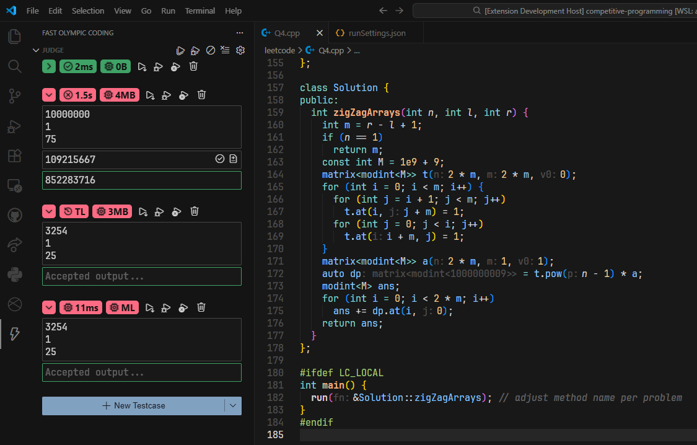
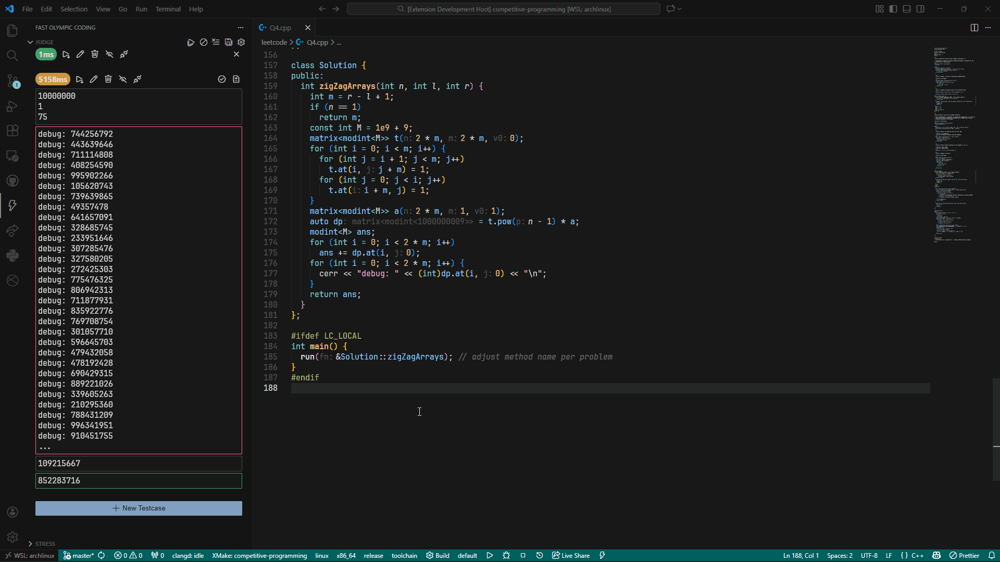
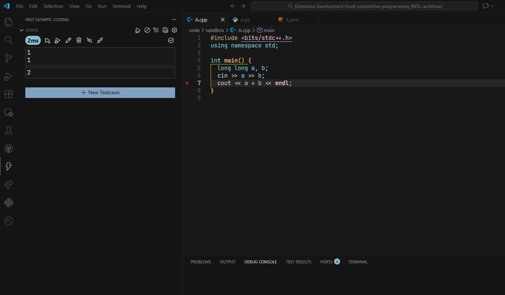
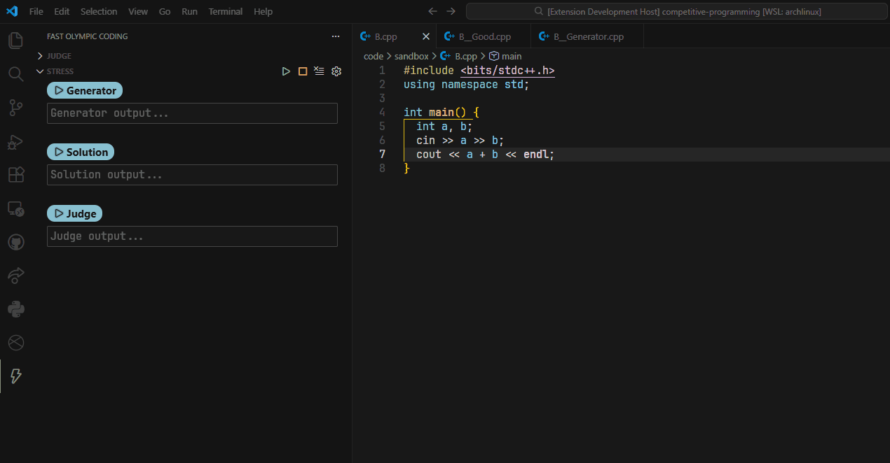
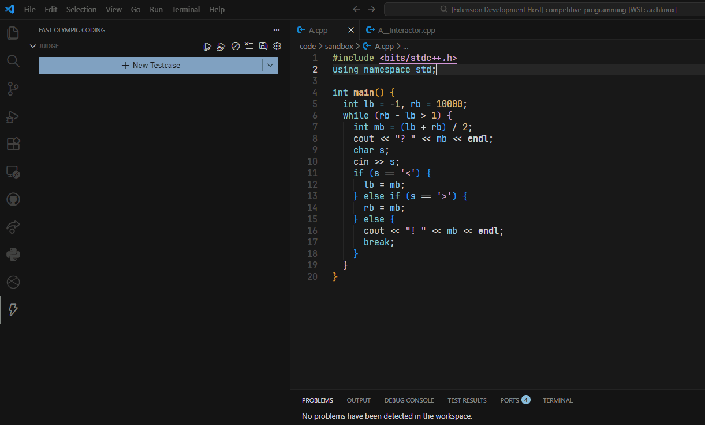
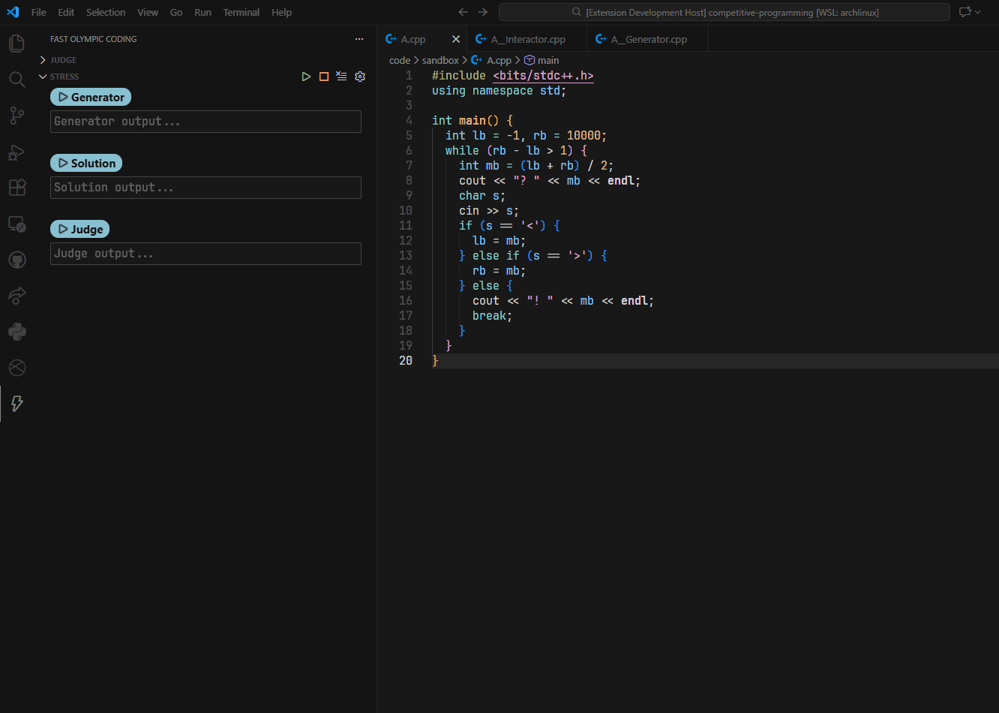
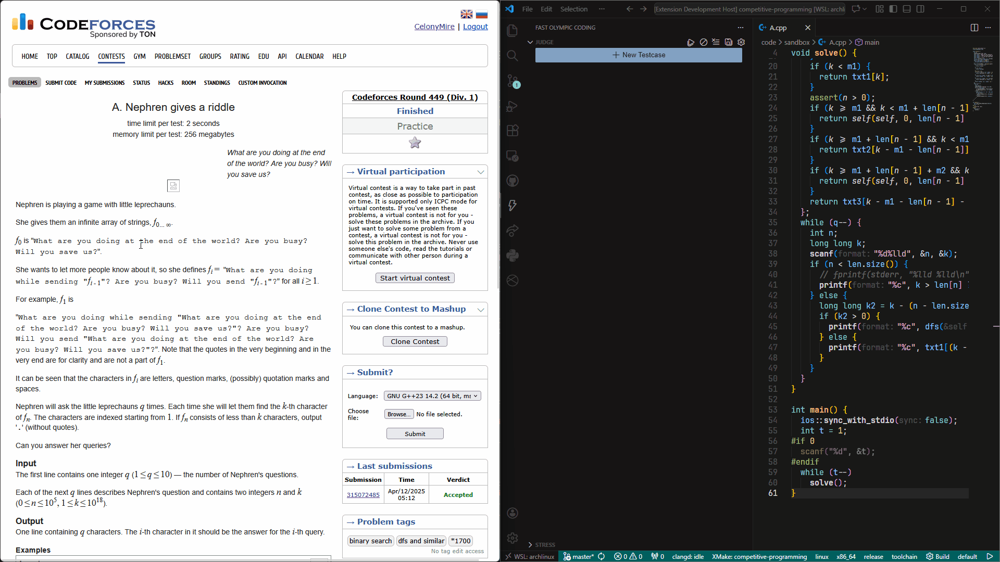
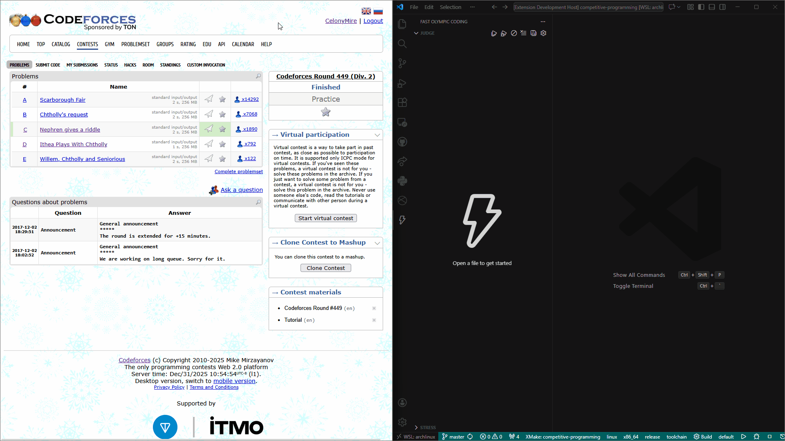

<h1 align="center">⚡ Fast Olympic Coding ⚡</h1>



<p align="center">


</p>

<p align="center"><i>Once a mighty Competitive Programming plugin... Reborn with the powers of VSCode!</i></p>

## ⚡ Overview

- [📜](#-judge) Minimal and _adaptive_ UI for maximized functionality and view utilization
- [🪲](#-debugging) Extension agnostic configuration for VSCode debugging UX with real-time inputs
- [🐞](#-stress-tester) Built-in stress tester to aid your debugging
- [🗨️](#️-interactive-mode) First-class support for interactive problems for **both** [Judge](#-judge) and [Stress Tester](#-stress-tester!
- [👜](#-inserting-prewritten-code) Insert file templates without leaving your code
- [🛜](#-competitive-companion) Support for [Competitive Companion](https://github.com/jmerle/competitive-companion) for efficient problem gathering
- ⚡ **_BLAZINGLY FAST!_** Asynchronous design + optimizations = **99%** spam proof!

### 📥 Install within Visual Studio Code or at [Visual Studio Marketplace](https://marketplace.visualstudio.com/items?itemName=sam20908.vscode-fastolympiccoding)

---

### </> Setting Up

Provide run settings for the languages you use in `settings.json`. Here are some examples for C++, Python, and Java:

```json
{
  "fastolympiccoding.runSettings": {
    ".cpp": {
      "compileCommand": "g++ ${path:${file}} -o ${path:${fileDirname}/${fileBasenameNoExtension}${exeExtname}}",
      "runCommand": "${path:${fileDirname}/${fileBasenameNoExtension}${exeExtname}}"
    },
    ".py": {
      "runCommand": "python ${path:${file}}"
    },
    ".java": {
      "compileCommand": "javac ${path:${file}}",
      "runCommand": "java -cp ${fileDirname} ${fileBasenameNoExtension}"
    }
  }
}
```

We can use the following variables in the syntax of `${...}`

- Most of [VSCode's built-in variables](https://code.visualstudio.com/docs/editor/variables-reference)
- `${exeExtname}` returns `.exe` for Windows and an empty string for other platforms
- `${path:*value*}` normalizes \*value\* into a valid path string for the current platform

<details>
  <summary>Settings per language</summary>

- `compileCommand` (optional): Command to run before `runCommand` when the file content changed
- `runCommand`: Command to run the solution
- `currentWorkingDirectory` (optional): sets the current working directory for `runCommand`
</details>

<details>
  <summary>Folder-specific settings</summary>

You can create specialized `runSettings.json` files to override settings for files within specific directories. The extension traverses from the workspace root directory up to the file folder, merging the settings along the way in that order.

**How it works:**

1. Settings are loaded from the workspace root down to your file's directory
2. Each folder's settings override the previous ones (closer to your file = higher priority)
3. VS Code's global `fastolympiccoding.runSettings` serve as the base settings

**Example structure:**

```
workspace/
├── runSettings.json          # Base settings for entire workspace
├── contests/
│   ├── runSettings.json      # Overrides for contests folder
│   └── codeforces/
│       ├── runSettings.json  # Overrides for codeforces folder
│       └── solution.cpp      # Uses merged settings from all 3 files
```

❗You **DO NOT** have to fill in every key for folder-specific settings. `runCommand` is **OPTIONAL** because they are expected to be at least in the base settings.

**🎯 EXAMPLE**: Create different folders and settings for different online judges! This provides the following benefits:

- Enforce different set of supported languages
- Different set of requirements within the same language. For example, USACO only supports C++17 while CodeForces generally update to newer standards.

**⚡ Note**: Changes to `runSettings.json` files are automatically detected and cached for performance.

</details>

---

### 📜 Judge

The UI adapts to VSCode's theme, font family and font size. Minimalism from the old plugin has been improved with [VSCode Codicons](https://microsoft.github.io/vscode-codicons/dist/codicon.html) and the native look of VSCode. The new UI experience is integrated into both Judge and Stress Tester windows.

- Run, edit, hide, skip testcases, you name it!
- Hidden optimizations such as batched IO, truncating huge IO, and cached compilations.
- Dedicated popup for compiler errors with color support
- ... and so much more!



<details>
  <summary>General setting for both Testcase Window and Stress Tester</summary>

- `maxDisplayCharacters`: Maximum number of characters to display for each output
- `maxDisplayLines`: Maximum number of lines to display for each output
</details>

---

### 🪲 Debugging

The extension typically attaches the debugger to an existing process, which allows custom inputs to be propagated to the program. However, each language has its own set of tooling. Adapt the commands as necessary!

**🚨Please use `${debugPort}` as the port for your debugging servers!** The hand-picked port provides the following benefits:

1. The operating system allocated the port to ensure it is available
2. Detects when the debugging server fails to launch at the chosen port within a timeframe
3. Frees the port when error occurs

**‼️NOT ALL DEBUGGERS ARE EQUAL!** Between debugging servers for the same language, they may not have the same set of features or work the same way! Same warning applies to VSCode debugger extensions!



<details>
  <summary>Additional language settings for debugging support</summary>

- `debugCommand`: Command to start the solution under a debug server
- `debugAttachConfig`: Name of `launch.json` attach configuration.
</details>

<details>
  <summary>Example C++ configuration</summary>

I recommend either Microsoft's official [**C/C++**](https://marketplace.visualstudio.com/items?itemName=ms-vscode.cpptools) or [**Native Debug**](https://marketplace.visualstudio.com/items?itemName=webfreak.debug). CodeLLDB does not work because `lldb-server` cannot send real-time inputs.

**C++ (and other compiled languages) requires debug symbols to be compiled in!** Easiest way is to add `-g` flag to your compile command.

Since both of them work with `gdbserver`, ensure that is installed, which is also what I tested with.

Here are the steps for **Native Debug**, which should be very similar with **Microsoft C/C++**:

1. Add these settings for `.cpp`:

```json
{
  "fastolympiccoding.runSettings": {
    ".cpp": {
      // compile and run configurations from above...
      "debugCommand": "gdbserver :${debugPort} ${path:${fileDirname}/${fileBasenameNoExtension}${exeExtname}}",
      "debugAttachConfig": "GDB: Attach"
    }
  }
}
```

1. Create a GDB attach configuration in `.vscode/launch.json`:

```json
{
  "configurations": [
    {
      "name": "GDB: Attach",
      "type": "gdb",
      "request": "attach",
      "executable": "${path:${fileDirname}/${fileBasenameNoExtension}${exeExtname}}",
      "target": ":${debugPort}",
      "remote": true,
      "cwd": "${workspaceRoot}",
      "valuesFormatting": "prettyPrinters"
    }
  ]
}
```

</details>

<details>
  <summary>Example Python configuration</summary>

I recommend Microsoft's official [**Python Debugger**](https://marketplace.visualstudio.com/items?itemName=ms-python.debugpy) for the best experience. The extension has built-in support for `debugpy`, which is the de-facto Python debugging server.

Ensure you have `debugpy` installed via `pip`.

Here are the steps for **Python Debugger**:

1. Add these settings for `.py`:

```json
{
  "fastolympiccoding.runSettings": {
    ".py": {
      // compile and run configurations from above...
      "debugCommand": "python -m debugpy --listen ${debugPort} --wait-for-client ${path:${file}}",
      "debugAttachConfig": "Python: Attach"
    }
  }
}
```

1. Create a `debugpy` attach configuration in `.vscode/launch.json`:

```json
{
  "configurations": [
    {
      "name": "Python: Attach",
      "type": "debugpy",
      "request": "attach",
      "connect": {
        "port": "${debugPort}"
      },
      "justMyCode": true
    }
  ]
}
```

</details>

<details>
  <summary>Example Java configuration</summary>

I recommend Microsoft's official [**Debugger for Java**](https://marketplace.visualstudio.com/items?itemName=vscjava.vscode-java-debug) for the best experience. For some reason, Oracle's **Java** extension ignores breakpoints.

**Compile your Java files with debug symbols!** Add `-g` flag to your compile command.

Ensure you have **Java Development Kit** version 1.8+ installed.

Here are the steps for **Debugger for Java**:

1. Add these settings for `.java`:

```json
{
  "fastolympiccoding.runSettings": {
    ".java": {
      // compile and run configurations from above...
      "debugCommand": "java -agentlib:jdwp=transport=dt_socket,server=y,suspend=y,address=${debugPort} -cp ${path:${fileDirname}} ${fileBasenameNoExtension}",
      "debugAttachConfig": "Java: Attach"
    }
  }
}
```

1. Create a Java attach configuration in `.vscode/launch.json`:

```json
{
  "configurations": [
    {
      "name": "Java: Attach",
      "type": "java",
      "request": "attach",
      "hostName": "localhost",
      "port": "${debugPort}"
    }
  ]
}
```

</details>

---

### 🐞 Stress Tester

Required files (naming scheme can be configured in settings):

- `<name>.[ext]`: the solution to bruteforce against
- `<name>__Good.[ext]`: the solution that outputs the correct answer
- `<name>__Generator.[ext]`: to generate inputs for the other 2 files
  - **The extension provides a 64-bit integer seed input for random number generators!**

- **💡TIP**: To stress test for **Runtime Error** instead of **Wrong Answer**, have the good solution be the same as the one to bruteforce against!

|  |
| :-------------------------------------------: |
|         _Demo of stress testing A+B!_         |

<details>
  <summary>Settings for Stress Tester</summary>

- `goodSolutionFile`: Full path for good solution file (supports `${...}`)
- `generatorFile`: Full path for generator file (supports `${...}`)
- `delayBetweenTestcases`: Amount of delay between generated testcases in milliseconds **(minimum: `5`)**
- `stressTestcaseTimeLimit`: Maximum time in milliseconds the Stress Tester is allowed to spend on one testcase **(`0` for no limit)**
- `stressTestcaseMemoryLimit`: Maximum time in megabytes the Stress Tester is allowed to use on one testcase **(`0` for no limit)**
- `stressTimeLimit`: Maximum time in milliseconds the Stress Tester is allowed to run **(`0` for no limit)**
</details>

---

### 🗨️ Interactive Mode

Required files (naming scheme can be configured in settings):

- `<name>.[ext]`: the solution to bruteforce against
- `<name>__Interactor.[ext]`: the interactor to communicate with

If you're using the stress tester, then you'll also need:

- `<name>__Generator.[ext]`: the generator to give the interactor the secret answer

‼️**FLUSH YOUR OUTPUTS!** Even though this requirement has been stated in every interactive problem, it is still worth mentioning in case the files are interacting weirdly. **FLUSHING SHOULD BE THE FIRST THING TO DOUBLE CHECK**.

Due to the lack of standardization of interactor's results, I have taken the middle ground of various online judges' interactor's behavior. **The exit code of the interactor will be used to determine the acceptance of the solution**. Below lists the exit codes and the verdict:

| Code                      | Verdict          |
| ------------------------- | ---------------- |
| 0                         | ✅ Accepted      |
| Non-zero                  | ❌ Wrong Answer  |
| _null_ (often from crash) | ⚠️ Runtime Error |

**ℹ️ Partial points are not supported!**

Interactive testcases have a special badge to make them distinguishable. If there is no set secret, the testcase will ask you to provide one. **This is a multi-line textbox because you have to give all the data in one go!**

|  |
| :---------------------------------------------------------: |
| _The convenient workflow of running interactive testcases!_ |

|            |
| :-------------------------------------------------------------------------: |
| _Stress testing interactives is almost the same as regular stress testing!_ |

---

### 👜 Inserting Prewritten Code

- Add the root directory of the templates to the settings
- **NOTE**: Remove trailing newlines for fold to work (folding is optional via settings)
  - Folding depends on VSCode support, which may require other extensions depending on the language.

|  |
| :---------------------------------------------------------: |
| _Adding a tree reroot DP template without switching files_  |

<details>
  <summary>Possible settings</summary>

- `fileTemplatesBaseDirectory`: Full path to the base directory of all prewritten files (supports `${...}`)
- `fileTemplatesDependencies` (optional): Maps a template path relative to base directory to a list of other relative template paths that this one depends on
- `foldFileTemplate` (default: `false`): Whether to fold the newly inserted prewritten code
</details>

---

### 🛜 Competitive Companion

[Competitive Companion](https://github.com/jmerle/competitive-companion) is a widely recognized browser plugin to conveniently fetch problem inputs. The plugin works with wide range of online judges and is actively maintained. Native support has been integrated directly into the extension for optimal workflow.

|            |
| :---------------------------------------------------------: |
| _Using Competitive Companion to parse a CodeForces problem_ |

|  |
| :-----------------------------------------------: |
|   _We can parse an entire CodeForces Contest!_    |

<details>
  <summary>Settings for Competitive Companion integration</summary>

- `automaticallyStartCompetitiveCompanion` (default: `true`): Automatically start listening for Competitive Companion when VSCode starts
- `openSelectedFiles` (default: `true`): Whether to open all the selected files
- `askForWhichFile` (default: `false`): Ask for which file to write testcase onto, even when a file is currently opened and only a single problem has been received
- `includePattern` (default: `**/*`): Glob pattern to filter in the included files for asking prompt
- `excludePattern` (default: _empty_): Glob pattern to filter out the included files for asking prompt
- `port` (default: _1327_): Port number to listen from Competitive Companion
</details>

---

### © Attributions

- [FastOlympicCoding](https://github.com/Jatana/FastOlympicCoding): The original Sublime Text package that inspired this extension 💖
- [Flaticon](https://www.flaticon.com/): Icon for this extension 💖
